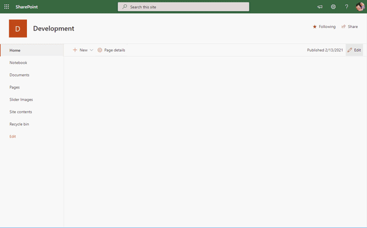

# Image Slider

## Summary
This a SharePoint Online modern web part of an image slider, which cycles images from a Document Libray as a slideshow. It works with a series of images, text, or custom markup. It also includes support for previous/next controls and indicators.

The supporting Document Library is deployed when the solution is added to the site. 

## Updating from 1.0.0.0 to 1.1.0.0
On upgrade to 1.1.0.0, and you want to use the new Display Order Column, please add the column to the Default View. 

## Applies to

- [SharePoint Framework](https://aka.ms/spfx)
- [Microsoft 365 tenant](https://docs.microsoft.com/en-us/sharepoint/dev/spfx/set-up-your-developer-tenant)

### 3rd Party Packages
* [PnPjs](https://pnp.github.io/pnpjs/)
* [PnP Controls React](https://pnp.github.io/sp-dev-fx-controls-react/)
* [PnP Property Controls](https://pnp.github.io/sp-dev-fx-property-controls/)
* [Moment.js](https://momentjs.com/)

## Office 365 CDN
The Office 365 CDN is used by default for downloading generic resource assets like the Office 365 client applications from a public origin.

This image slide supports the use of the Office 365 CDN by enabling the document library deployed with the soluiton by the following PowerShell commands. 
~~~powershell
Connect-SPOService https://<tenant>-admin.sharepoint.com
Set-SPOTenantCdnEnabled -CdnType Both -Enable $true
Add-SPOTenantCdnOrigin -CdnType Public -OriginUrl */SliderImgs
~~~

Once enabled, just toggle the setting within the Web Part properties to utilize the Office 365 CDN to display your images. 
## Solution

Solution|Author(s)
--------|---------
SPFX Image Slider | [Shawn Fagan](https://twitter.com/fagansc)

## Version History

Version|Date|Comments
-------|----|--------
1.0.0.0|January 25, 2021|Initial release
1.1.0.0|february 13, 2021|Added New Order By Options

## Current Features
- Ability to adjust the Image Size
  - Small (Height: 300px)
  - Medium (Height: 350px)
  - Large (Height: 400px)
  - X-Large (Height: 450px)
- Ability to adjust the Slide Speed
  - Min Speed: 5 Seconds inbetween slides
  - Max Speed: 30 Seconds inbetween slides
- Ability to select the Display Image Filter
  - Display All Images within the Library
  - Display Images with the Enabled Flag set to Yes
  - Display Image based on the Publish Start & End fields
- Ability to select the field to use to order of images to be displayed
  - Modified Date
  - Created Date
  - Display Order Field
- Ability to select the direction of the field to order of images to be displayed
  - Ascending
  - Descending
- Hide or Show the Image Caption
- Hide or Show the Slide Indicators
- Render Images using Office 365 Public CDN
- Select a Default Image to display if no image is found in the libary
## Future Features
 - Multplie Layout Options
 - Configurable Caption Settings
 - Configurable Indicators Settings
 - Use of Office 365 Private CDN
 - SharePoint Online Theme integration
 - Controlling required Document Library fields based on Image Filter

## License
This web part is licensed under terms of Apache License V2.0. For further information see [LICENSE](LICENSE) file.

## Contribute
Please feel free to comment, feedback and contribute to this. Remember that this repository is maintained by a single person, so please be courteous and patient.

## References

- [Getting started with SharePoint Framework](https://docs.microsoft.com/en-us/sharepoint/dev/spfx/set-up-your-developer-tenant)
- [Building for Microsoft teams](https://docs.microsoft.com/en-us/sharepoint/dev/spfx/build-for-teams-overview)
- [Use Microsoft Graph in your solution](https://docs.microsoft.com/en-us/sharepoint/dev/spfx/web-parts/get-started/using-microsoft-graph-apis)
- [Publish SharePoint Framework applications to the Marketplace](https://docs.microsoft.com/en-us/sharepoint/dev/spfx/publish-to-marketplace-overview)
- [Microsoft 365 Patterns and Practices](https://aka.ms/m365pnp) - Guidance, tooling, samples and open-source controls for your Microsoft 365 development

---
## Disclaimer

**THIS CODE IS PROVIDED *AS IS* WITHOUT WARRANTY OF ANY KIND, EITHER EXPRESS OR IMPLIED, INCLUDING ANY IMPLIED WARRANTIES OF FITNESS FOR A PARTICULAR PURPOSE, MERCHANTABILITY, OR NON-INFRINGEMENT.**
